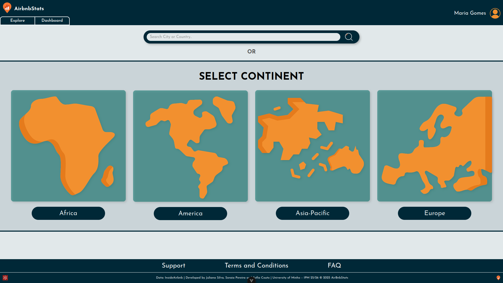
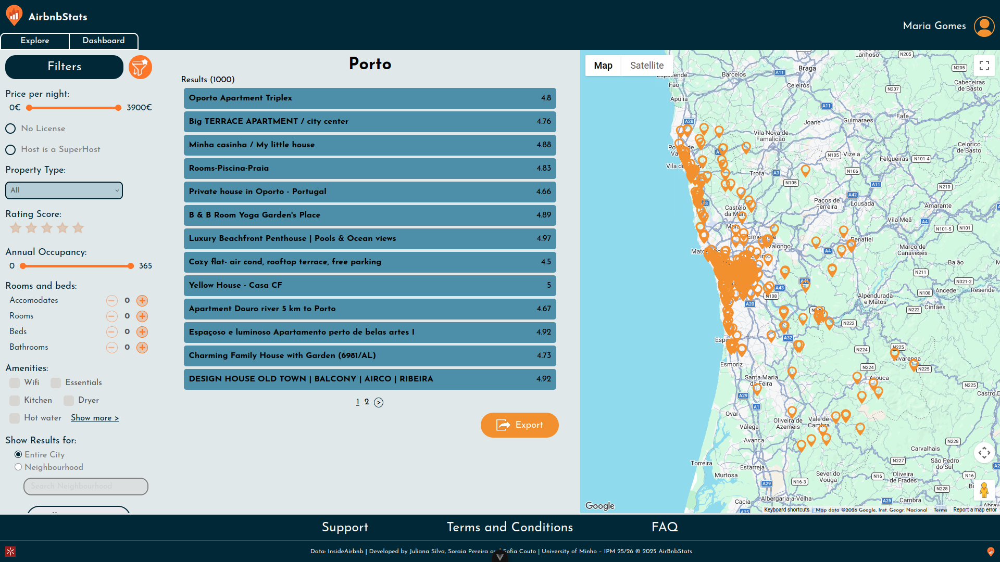
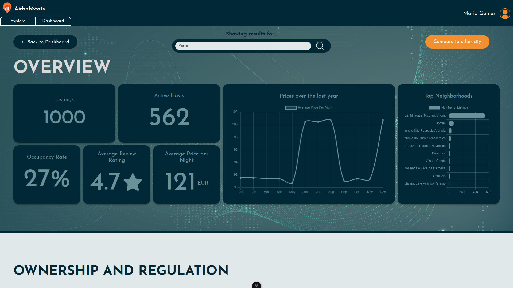
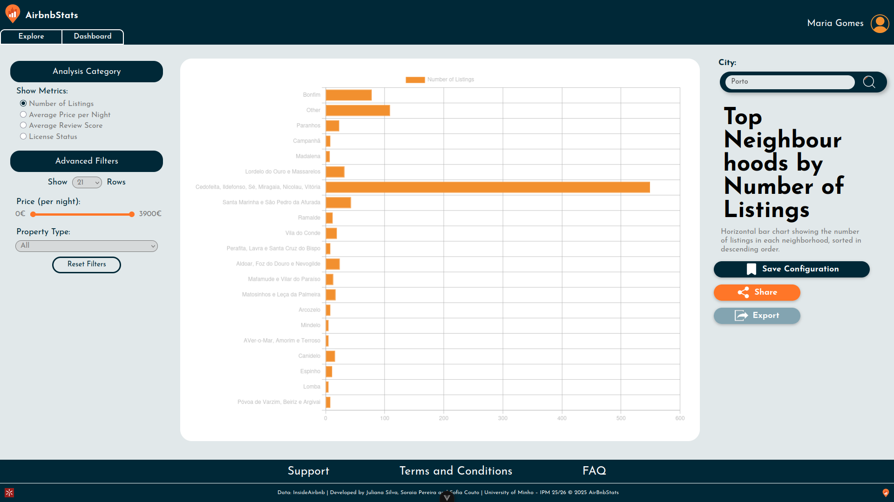

# AirbnbStats

**AirbnbStats** provides an intuitive web interface to explore [InsideAitbnb](https://insideairbnb.com/) data on property listings, pricing, and occupancy, allowing investigators, public managers, activists and other potential users to view and analyse the information needed to analyze the impact of Airbnb across different cities. 

This project was developed for the Human-Computer Interaction course in the 3rd year of Uminho's Software Engineering bachelors. In the first phase of the project we designed a [prototype of the application using Figma](https://www.figma.com/proto/n7wOA0VAQSEzCumZla0rty/Airbnb?node-id=239-67&t=80WCPfCYtXJluZC1-1&starting-point-node-id=52%3A2) based on user stories provided in the [`assignment`](assignemnt.pdf) and in the second phase we implemented the application using Vue.js. You can check the [`first phase's report`](report.pdf) (PT) for a heuristic analysis of the designed interface.

<p align="center">
  
</p>

## Key features

AirbnbStats includes a main explore page that allows users to filter and view listings by city and a dashboard page that provides an overview of general statistics for the selected city and lets users view and compare the evolution of different metrics over time through configurable charts. It's also possible to directly compare data from two different cities and save different configurations of filters and charts in the user's profile for laters use. For more details on the app's features, check the [`first phase's report`](report.pdf) (PT).

<p align="center">
  
  
  
</p>


## Team
* Juliana Silva ([`JulianaSilva8`](https://github.com/JulianaSilva8))
* Sofia Couto ([`sbmco05`](https://github.com/sbmco05))
* Soraia Pereira ([`sooraia`](https://github.com/sooraia))

## Results
- **1st phase:** 17/20
- **2nd phase:** 16/20

## Setup

Start the backend server:
```sh
cd backend
json-server --watch db.json
```

Go to the frontend directory and install dependencies:
```sh
cd projeto
npm install
```

Run the frontend server using the following command:

```sh
npm run dev
```